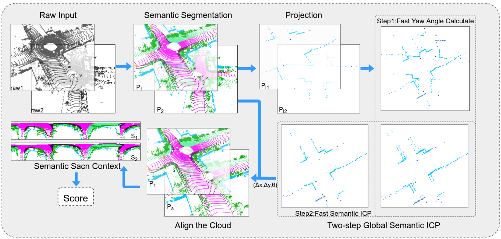
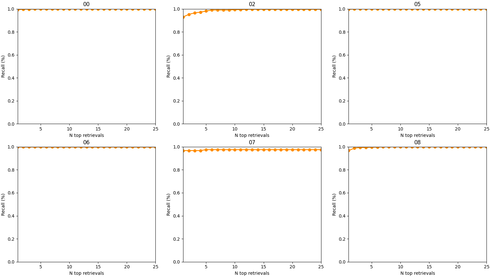
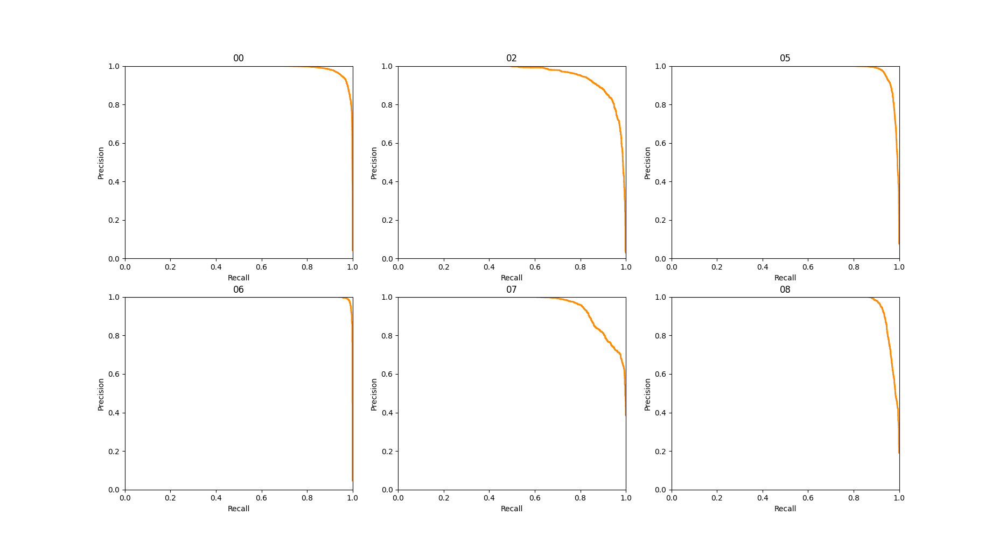

# SSC: Semantic Scan Context for Large-Scale Place Recognition
pass



## Citation
pass

## Requirements
[OpenCV](https://opencv.org/)  
[PCL](https://pointclouds.org/)  
[yaml-cpp](https://github.com/jbeder/yaml-cpp) 

## Usage
Build the code:
```bash
    mkdir build && cd build && cmake .. && make -j5
```
Modify the [configuration file](config/config.yaml).
```bash
    cd ../bin
    ./eval_pair
```
or

```bash
    cd ../bin
    ./eval_seq
```

## Data
### Pair Lists
[pairs](https://drive.google.com/file/d/1Y540LJFZHiaAooUX2KtxNIQhw-kzy7gQ/view?usp=sharing)

## Results

### Top-k Recall
When using 5 m as the threshold, the top-k recall rate is shown in the figure:



### Precision-Recall Curve
The accuracy-recall rate curve when $\alpha=100$:



## Acknowledgement

Thanks to the source code of some great works such as [Scan Context](https://github.com/irapkaist/scancontext) and [Intensity Scan Context](https://github.com/wh200720041/iscloam)