# SSC
Semantic Scan Context
## Requirements
[OpenCV](https://opencv.org/)  
[PCL](https://pointclouds.org/)  
[yaml-cpp](https://github.com/jbeder/yaml-cpp)  
## Usage
Build the code:
```bash
    mkdir build && cd build && cmake .. && make -j5
```
Modify the [configuration file](config/config.yaml).
```bash
    cd ../bin
    ./eval_pair or ./eval_seq
```
## pairs list
[pairs](https://drive.google.com/file/d/1Y540LJFZHiaAooUX2KtxNIQhw-kzy7gQ/view?usp=sharing)

## results

### Top-k Recall
<!--  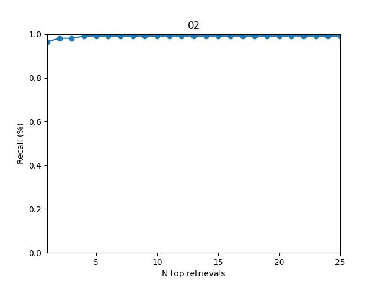 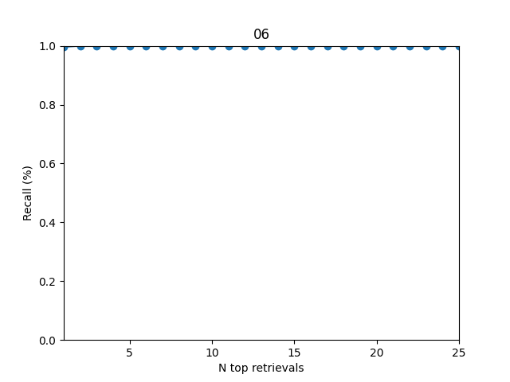

 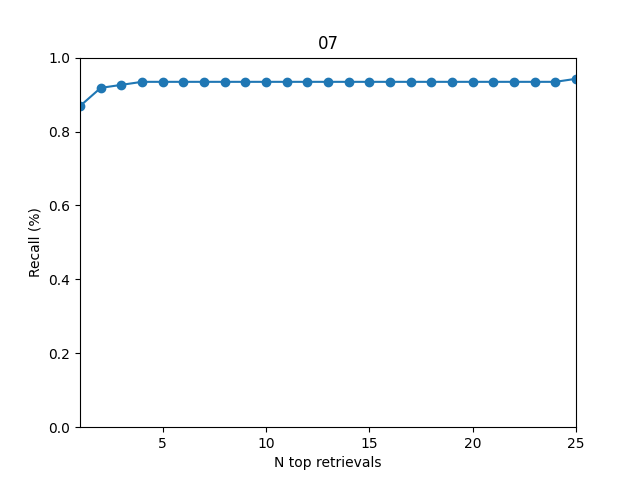 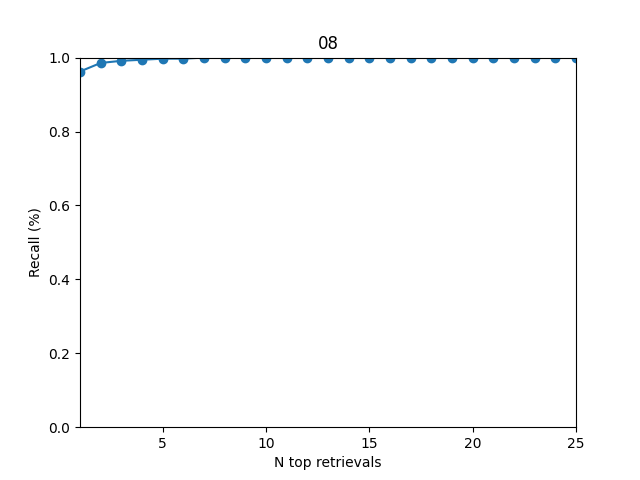 -->
  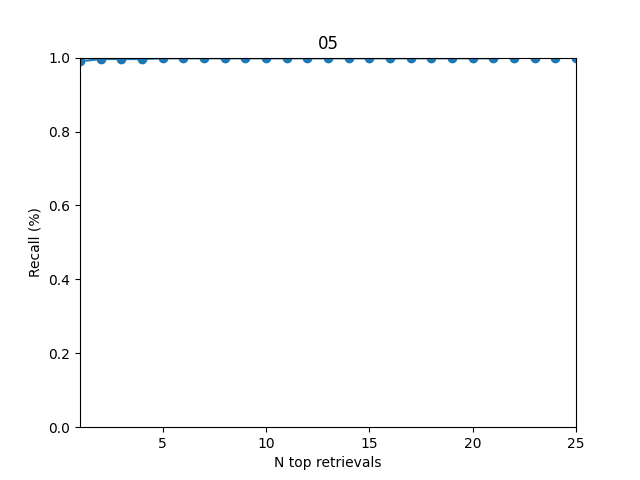   

### Precision-Recall Curve
<!-- 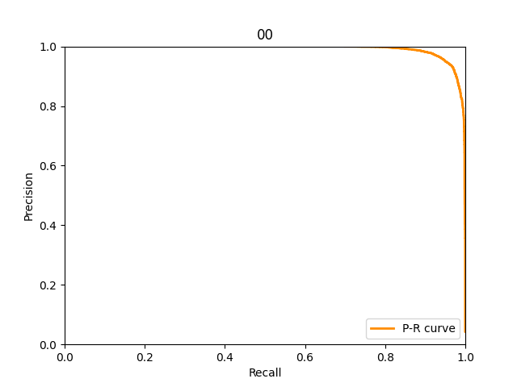 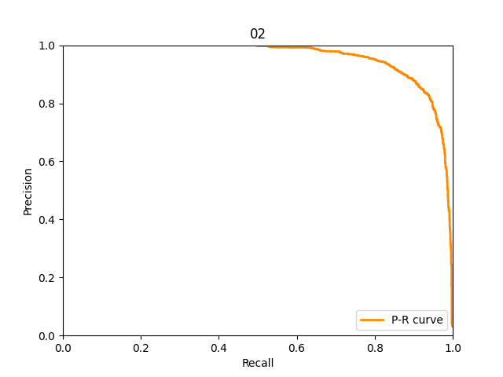 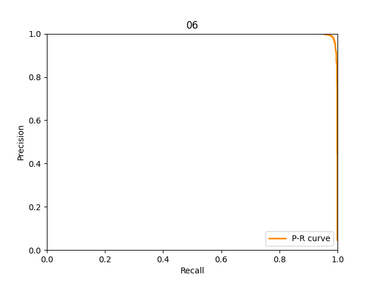

 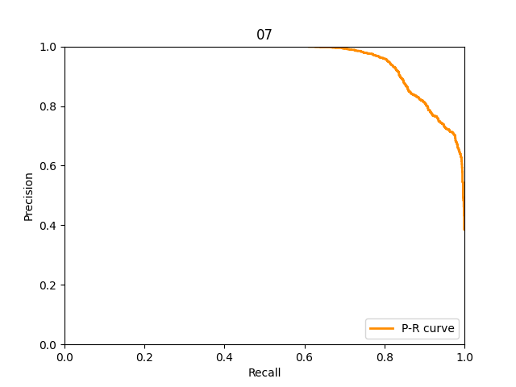 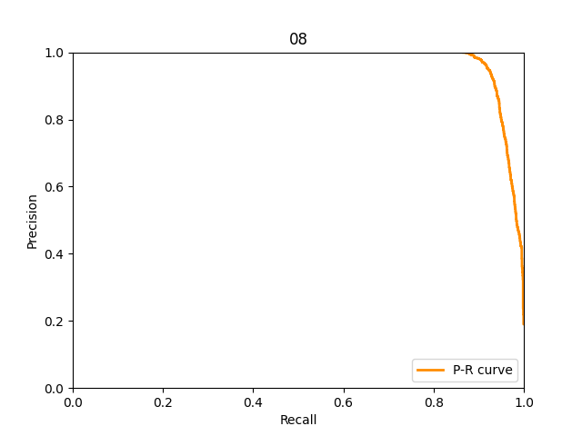 -->
  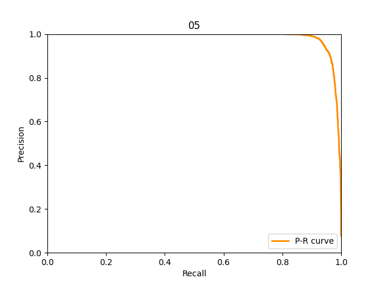   